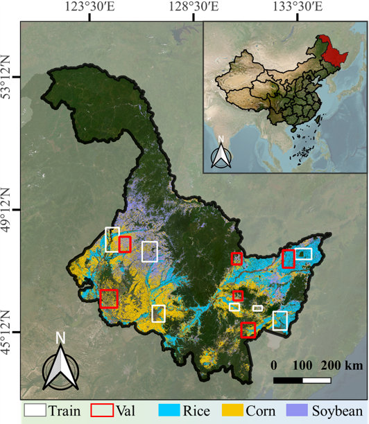

<h1 align="center"> HieraRS: A Hierarchical Segmentation Paradigm for Remote Sensing Enabling Multi-Granularity Interpretation and Cross-Domain Transfer </h1>
<h5 align="center"><em>
    <a href="https://github.com/AI-Tianlong" target="_blank">Tianlong Ai</a>, 
    Tianzhu Liu, 
    <a href="https://github.com/JHC626" target="_blank">Haochen Jiang</a>, 
    and Yanfeng Gu
</em></h5>
<h5 align="center"><em>
    Harbin Institute of Technology
</em></h5>


<!--
<p align="center">
  <a href="#Abstract">Abstract</a> |
  <a href="#📢-Latest-Updates ">News</a> |
  <a href="#🗺-MM-5B-Dataset">MM-5B</a> |
  <a href="#🌾-Crop10m-Dataset">Crop10m</a> |
  <a href="#🥰-Acknowledgement">Statement</a>
</p>
-->

<p align="center">
  <a href="https://arxiv.org/abs/2507.08741"></a>
</p>


## Abstract
Hierarchical land cover and land use (LCLU) classification aims to assign pixel-wise labels with multiple levels of semantic granularity to remote sensing (RS) imagery. However, existing deep learning-based methods face two major challenges: 1) They predominantly adopt a flat classification paradigm, which limits their ability to generate end-to-end multi-granularity hierarchical predictions aligned with tree-structured hierarchies used in practice. 2) Most cross-domain studies focus on performance degradation caused by sensor or scene variations, with limited attention to transferring LCLU models to cross-domain tasks with heterogeneous hierarchies (e.g.,LCLU to crop classification). These limitations hinder the flexibility and generalization of LCLU models in practical applications. To address these challenges, we propose HieraRS, a novel hierarchical interpretation paradigm that enables multi-granularity predictions and supports the efficient transfer of LCLU models to cross-domain tasks with heterogeneous tree-structured hierarchies. We introduce the Bidirectional Hierarchical Consistency Constraint Mechanism (BHCCM), which can be seamlessly integrated into mainstream flat classification models to generate hierarchical predictions, while improving both semantic consistency and classification accuracy. Furthermore, we present TransLU, a dual-branch cross-domain transfer framework comprising two key components: Cross-Domain Knowledge Sharing (CDKS) and Cross-Domain Semantic Alignment (CDSA). TransLU supports dynamic category expansion and facilitates the effective adaptation of LCLU models to heterogeneous hierarchies. In addition, we construct MM-5B, a large-scale multi-modal hierarchical land use dataset featuring pixel-wise annotations. Extensive experiments on MM-5B, Crop10m, and WHDLD validate the effectiveness and adaptability of the proposed HieraRS across diverse scenarios. The code and MM-5B dataset will be released at: https://github.com/AI-Tianlong/HieraRS.

---

## 📢 Latest Updates 
- **June-17-2025**: HieraRS repository created. [](https://github.com/AI-Tianlong/HieraRS)
- **July-11-2025**: The paper was released on arxiv. [](https://arxiv.org/abs/2507.08741)
## 📅 TODO List
- [ ] Release MM-5B dataset
- [ ] Release Crop10m dataset
- [ ] Release HieraRS code
- [ ] Release HieraRS weights

> ℹ️ The dataset will be released immediately after further manual verification. The code and weights will be released once the paper is accepted.


## 🗺 MM-5B Dataset
MM-5B: Multi-Modal Five-Billion-Pixels is a large-scale, multi-modal, hierarchical Land Cover and Land Use (LCLU) dataset, built upon the [Five-Billion-Pixels](https://x-ytong.github.io/project/Five-Billion-Pixels.html) foundation.

<p align="center">
  
</p>

<p>
MM-5B download links: 
  <a href="https://pan.baidu.com/s/1U5yjf7t1-RuaWMPOhSA1ow?pwd=MM5B"> Baidu Netdisk</a> |
  <a href="#"> Google Drive</a> |
  <a href="#"> Zenodo</a>
</p>

> ℹ️ 
 If you use MM-5B in your research, we kindly request that you also cite the dataset it is based on: [Five-Billion-Pixels](https://x-ytong.github.io/project/Five-Billion-Pixels.html).

## 🌾 Crop10m Dataset
<table>
  <tr>
    <td width="50%" valign="top">

<blockquote>
<strong>Crop10m:</strong> This dataset is used for crop classification experiments and originates from a cross-domain task presented in the paper. The labels are derived from the annual crop classification product proposed by <a href="https://www.nature.com/articles/s41597-021-00827-9">You et al.</a> The Sentinel-2 remote sensing imagery used was collected over Heilongjiang Province in northeastern China, covering cloud-free scenes from July to October 2019.
</blockquote>  

</td>
<td width="50%" valign="top" align="center">
  
</td>
  </tr>
</table>

<p>
Crop10m download links: 
  <a href="https://pan.baidu.com/s/1fonBgDyASDtKD4uFb705Sg?pwd=CROP"> Baidu Netdisk</a> |
  <a href="#"> Google Drive</a> |
  <a href="#"> Zenodo</a>
</p>


> ℹ️ If you use Crop10m in your research, we kindly request that you also cite the dataset it is based on: [*The 10-m crop type maps in  Northeast China during 2017–2019*](https://www.nature.com/articles/s41597-021-00827-9) 


## Visualization
Experimental Results Visualization on the MM-5B Dataset (GaoFen-2 Satellite Data).


Experimental Results Visualization on the MM-5B Dataset.


Experimental Results Visualization on the Crop10m Dataset.


## 🥰 Acknowledgement
We thank [Tong et al.](https://x-ytong.github.io/project/Five-Billion-Pixels.html) and [You et al.](https://www.nature.com/articles/s41597-021-00827-9) for providing high-quality datasets to the remote sensing community.
We are deeply grateful to every contributor of [MMSegmentation](https://github.com/open-mmlab/mmsegmentation) and [‌OpenMMLab](https://github.com/open-mmlab) for offering such robust and versatile open-source frameworks.

## 📜 Citation
if you find it helpful, please cite
```bibtex
@article{HieraRS_2025,
  title={Cross-Modal Bidirectional Interaction Model for Referring Remote Sensing Image Segmentation},
  author={Tianlong Ai, Tianzhu Liu, Haochen Jiang and Yanfeng Gu},
  journal={arXiv:2507.08741},
  year={2025}
}
```

## 🌟Stargazers over time


