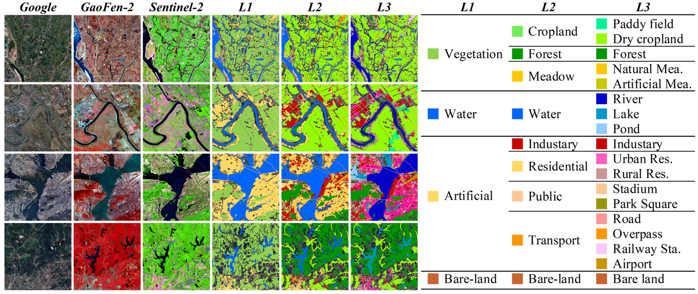

<h1 align="center"> HieraRS: A Hierarchical Segmentation Paradigm for Remote Sensing Enabling Multi-Granularity Interpretation and Cross-Domain Transfer </h1>
<h5 align="center"><em>
    <a href="https://github.com/AI-Tianlong" target="_blank">Tianlong Ai</a>, 
    Tianzhu Liu, 
    <a href="https://github.com/JHC626" target="_blank">Haochen Jiang</a>, 
    and Yanfeng Gu*
</em></h5>
<h5 align="center"><em>
    Harbin Institute of Technology
</em></h5>

## Abstract
Hierarchical land cover and land use (LCLU) classification aims to assign pixel-wise labels with multiple levels of semantic granularity to RS imagery. However, existing deep learning-based methods face two major challenges: 1) They predominantly adopt a flat classification paradigm, which limits their ability to generate end-to-end multi-granularity hierarchical predictions aligned with tree-structured hierarchies used in practice. 2) Most cross-domain studies focus on performance degradation caused by sensor or scene variations, with limited attention to transferring LCLU models to cross-domain tasks with heterogeneous hierarchies (e.g.,LCLU to crop classification). These limitations hinder the flexibility and generalization of LCLU models in practical applications. To address these challenges, we propose HieraRS, a novel hierarchical interpretation paradigm that enables multi-granularity predictions and supports the efficient transfer of LCLU models to cross-domain tasks with heterogeneous tree-structured hierarchies. We introduce the Bidirectional Hierarchical Consistency Constraint Mechanism (BHCCM), which can be seamlessly integrated into mainstream flat classification models to generate hierarchical predictions, while improving both semantic consistency and classification accuracy. Furthermore, we present TransLU, a dual-branch cross-domain transfer framework comprising two key components: Cross-Domain Knowledge Sharing (CDKS) and Cross-Domain Semantic Alignment (CDSA). TransLU supports dynamic category expansion and facilitates the effective adaptation of LCLU models to heterogeneous hierarchies. In addition, we construct MM-5B, a large-scale multi-modal hierarchical land use dataset featuring pixel-wise annotations. Extensive experiments on MM-5B, Crop10m, and WHDLD validate the effectiveness and adaptability of the proposed HieraRS across diverse scenarios. The code and MM-5B dataset will be released at: https://github.com/AI-Tianlong/HieraRS.

---

## 📢 Latest Updates 
- **June-17-2025**:  HieraRS repository created. 

## 📅 TODO List
- [ ] Release MM-5B dataset
- [ ] Release HieraRS code
- [ ] Release HieraRS weights

> ℹ️ The dataset will be released immediately after further manual verification. The code and weights will be released once the paper is accepted.

## 🗺 MM-5B Dataset
MM-5B: Multi-Modal Five-Billion-Pixels is a large-scale, multi-modal, hierarchical Land Cover and Land Use (LCLU) dataset, built upon the [Five-Billion-Pixels](https://x-ytong.github.io/project/Five-Billion-Pixels.html) foundation.

  

- [x] [Baidu Netdisk](https://pan.baidu.com/s/1U5yjf7t1-RuaWMPOhSA1ow?pwd=MM5B): (only available in China region, extraction code: MM5B)
- [ ] [Google Drive](https://pan.baidu.com/s/1U5yjf7t1-RuaWMPOhSA1ow?pwd=MM5B)
- [ ] [Zendo](https://pan.baidu.com/s/1U5yjf7t1-RuaWMPOhSA1ow?pwd=MM5B)

> ℹ️ If you use MM-5B in your research, we kindly ask that you also cite the [Five-Billion-Pixels](https://x-ytong.github.io/project/Five-Billion-Pixels.html) dataset on which it is based.

## 🥰 Acknowledgement
We thank [Five-Billion-Pixels](https://x-ytong.github.io/project/Five-Billion-Pixels.html) for providing a high-quality dataset to the remote sensing community, and [‌OpenMMLab](https://github.com/open-mmlab) for their powerful and feature-rich open-source libraries.

## 🌟Stargazers over time

